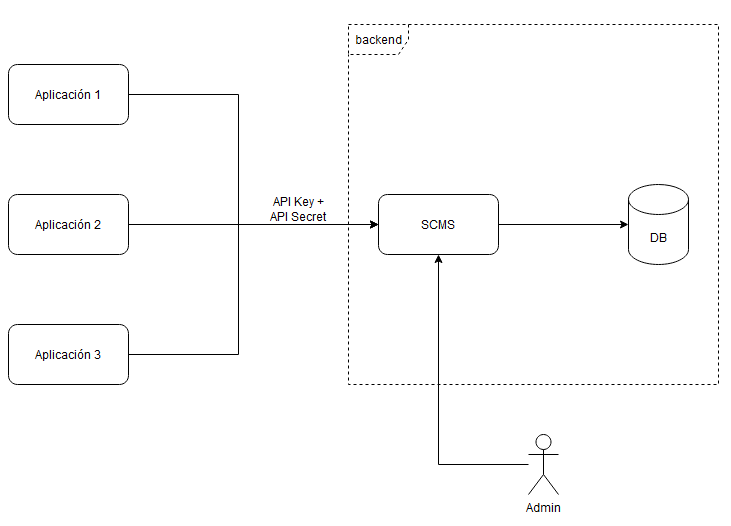

# Super Configuration Management System (SCMS)

## Intro

Este es un servicio web REST que permite administrar la configuración de distintas aplicaciones en un sistema centralizado.

Un operador (administrador en principio) puede registrar distintas Aplicaciones y asociarles uno o más Ambientes, a los cuales se le pueden agregar registros de configuración (similares a los que se guardan en un archivo application.properties).

Estos valores de configuración pueden ser consultados por cada Aplicación registrada mediante una integración REST usando credenciales que se le asignen dentro de nuestro sistema.

Representación del sistema:


Ejemplo:

	El administrador registra en SCMS la Aplicación 'Blog' y le crea un Ambiente 'desarrollo'. Luego le agrega a este Ambiente dos registros de configuración:
	{
		"config-1":"valor-1",
		"config-2":"valor-2"
	}
	El administrador le comparte las credenciales generadas por el sistema (API Key + API Secret) al responsable de 'Blog', quien procede a realizar una integración con SCMS.
	Esta integración consistirá en ejecutar una consulta de configuración usando las credenciales provistas.
	Por ejemplo podríamos hacer algo de la forma: 'GET https://scms.flexia.com.ar/apps/1/env/2/configuration' para obtener las configuraciones de la Aplicación con ID 1 y el Ambiente con ID 2.

## Características

- El sistema tiene al menos un administrador, idealmente con la posibilidad de agregar más.

- El administrador puede crear Aplicaciones, indicando al menos un nombre y una descripción para la misma.

- El administrador puede crear uno o más Ambientes asociados a una Aplicación. Cada ambiente deberá tener nombre y descripción.

- El administrador puede agregar uno o más registros de configuración a un Ambiente. Además, puede editarlos o eliminarlos.
Aclaración: Un registro de configuración consiste en una entrada clave valor, podemos pensarlo como un archivo de properties pero almacenado en este sistema.

Algunas configuraciones de ejemplo:
```json
{
	"my-db.url": "jdbc:postgresql://localhost:5432/my_example_db",
	"external-api.token": "yJ0eXAiOiJKV1QiLCJhbGciOiJIUzUxMiJ9.eyJzdWIiOiIxIiwibmFtZSI6ImFkbWluIiwiZXhwIjoy",
	"enable-validations": "true"
}
```

- Un Ambiente se asocia a una API Key (identificador público) y un API Secret (clave secreta) al momento de ser creado. 
El API Secret es almacenado de forma segura, ya que es equivalente a un password.

Ejemplos:
```
# API Key
d6d0060f-ab85-416a-8cc7-d6a4b3a7c3e2
# API Secret (Previo a encoding)
1c81c250-142d-47f6-bd24-4d626670821f
```

- Cada aplicación registrada en el sistema puede consultar sus parámetros de configuración para un determinado ambiente mediante el uso de sus credenciales (API Key + API Secret).
Estas credenciales viajan como headers HTTP en el request.
